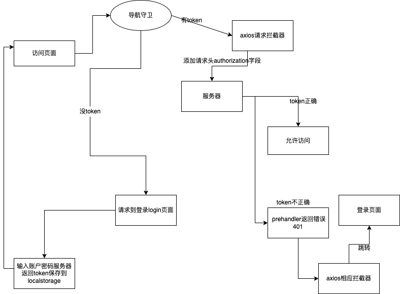

# vue-login-token

## Project setup
```
yarn install
```

### Compiles and hot-reloads for development
```
yarn serve
```

### Compiles and minifies for production
```
yarn build
```

### Lints and fixes files
```
yarn lint
```
### Run express server
```
node app.js
```
### Run express server


### Customize configuration
See [Configuration Reference](https://cli.vuejs.org/config/).

### Flowchart

